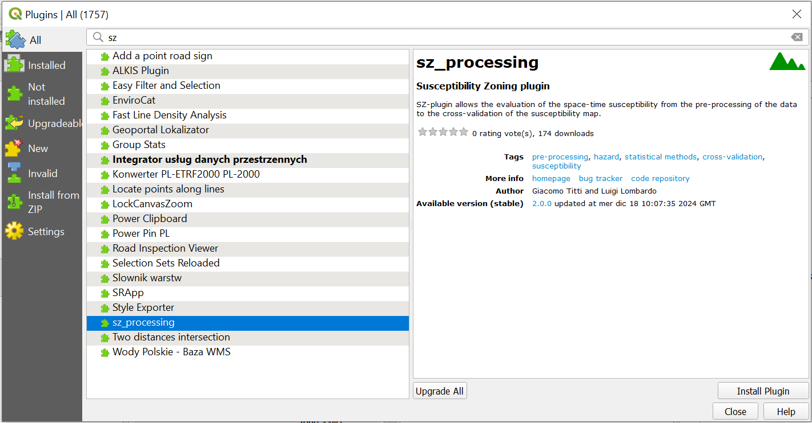
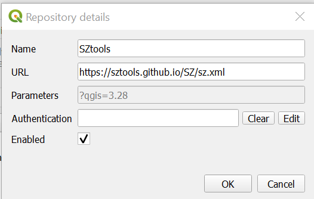
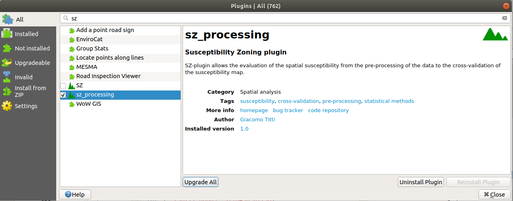
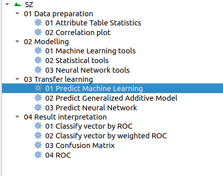
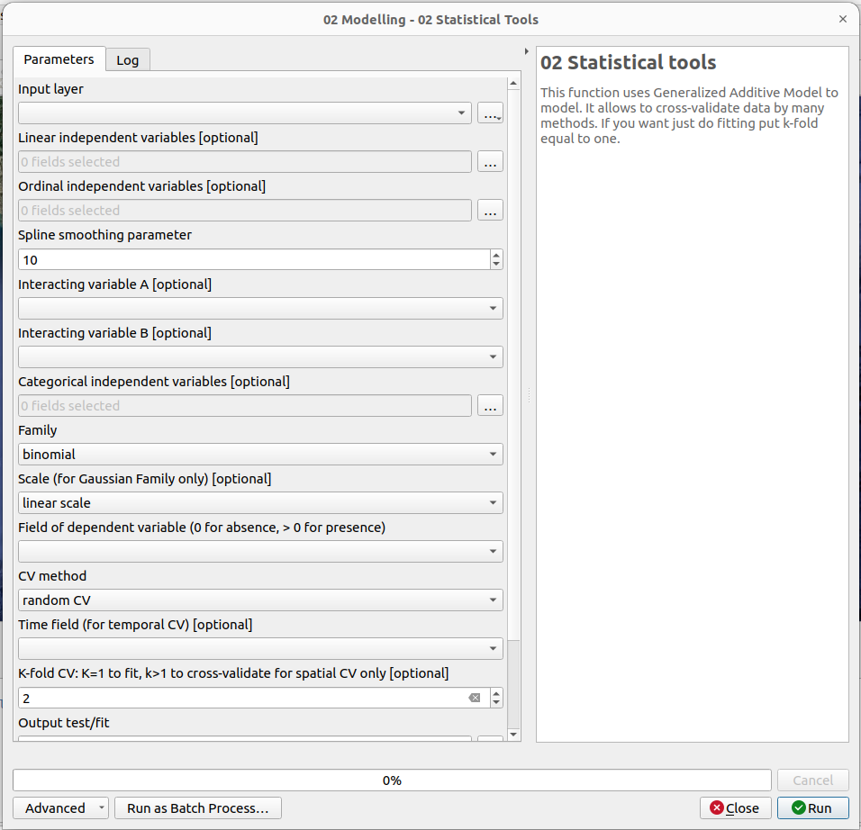
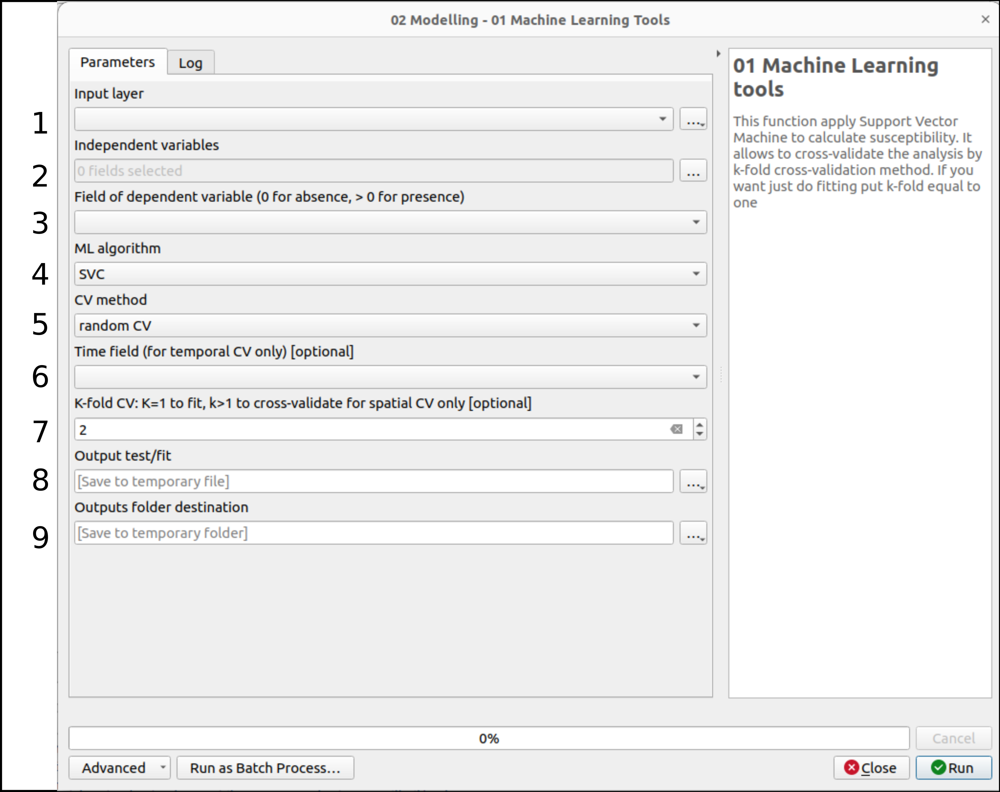
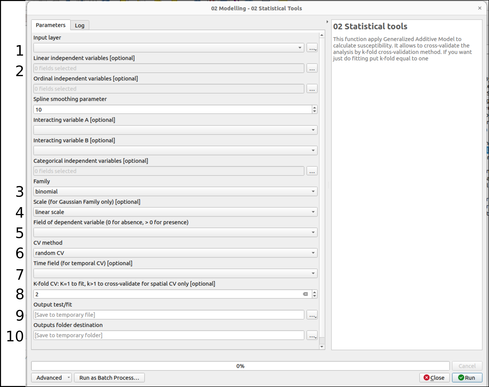
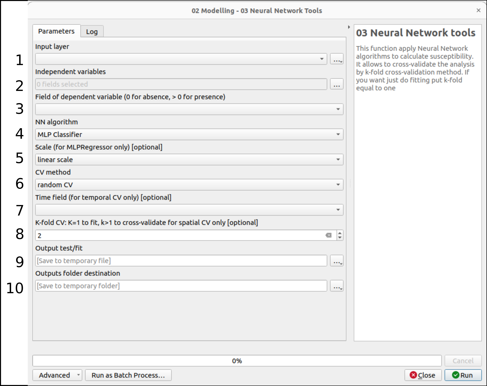
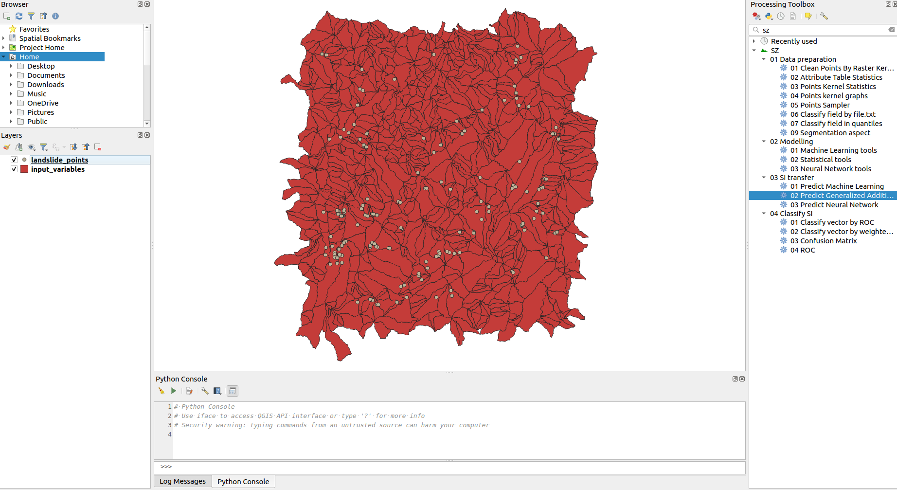
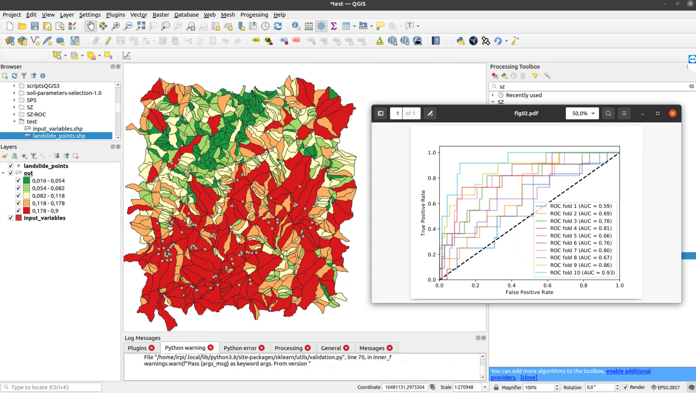

Spatiotemporal data-driven Zoning plugin (SZ)
=================================

.. seealso::

   You can find the plugin repository `here <https://github.com/SZtools/SZ-plugin>`_

.. toctree::
   :maxdepth: 4

   Introduction <#introduction>
   Installation <#installation>
   Third-part libraries and plugins used <#third-part-libraries-and-plugins-used>
   Tutorial <#tutorial>
   Application <#application>
   Publications <#publications>
   Presentations <#presentations>
   Credits <#credits>
   Contacts <#contacts>

Introduction
============

This repository contains the code for a `QGIS <https://www.qgis.org>`_ plugin, called "Spatiotemporal data-driven Zoning plugin" (SZ-plugin), aiming at creating maps of susceptibility to various natural forcing elements.

The plugin has been developed with a main focus and application towards landslides susceptibility, but it can be applied to different types of natural events or inter-disciplinary applications.

The plugin uses several type of statistical, machine learning models for susceptibility evaluation, such as:

* Generalized Additive Model with two distributions: Binomial, Gaussian (see `pygam <https://pygam.readthedocs.io>`_)
* Decision Tree (see `scikit-learn <https://scikit-learn.org/stable/modules/generated/sklearn.tree.DecisionTreeClassifier.html>`_)
* Support Vector Machine (see `scikit-learn <https://scikit-learn.org/stable/modules/generated/sklearn.svm.SVC.html>`_)
* Random Forest (see `scikit-learn <https://scikit-learn.org/stable/modules/generated/sklearn.ensemble.RandomForestClassifier.html#sklearn.ensemble.RandomForestClassifier>`_)
* Multi-layer Perceptron as classifier (see `scikit-learn <https://scikit-learn.org/stable/modules/generated/sklearn.neural_network.MLPClassifier.html#sklearn.neural_network.MLPClassifier>`_) and regressor (see `scikit-learn <https://scikit-learn.org/stable/modules/generated/sklearn.neural_network.MLPRegressor.html#sklearn.neural_network.MLPRegressor>`_)

The plugin allows the user to perform spatial and temporal analysis implementing space-time cross-validation (CV) methods: 

* Kfold CV (see `scikit-learn <https://scikit-learn.org/stable/modules/generated/sklearn.model_selection.KFold.html>`_)
* Spatial CV (see `Elia et al., 2023 <https://doi.org/10.1016/j.scitotenv.2023.165289>`_)
* Time Series Split temporal-CV (see `scikit-learn <https://scikit-learn.org/stable/modules/generated/sklearn.model_selection.TimeSeriesSplit.html>`_)
* Leave One Out temporal-CV (see `scikit-learn <https://scikit-learn.org/stable/modules/generated/sklearn.model_selection.LeaveOneOut.html>`_)
* Space-time CV (Leave One Out/Spatial CV)

Moreover the plugin allows the user to run space-time transferability with all the models implemented.

Installation
============

Minimum requirements
--------------------

Tested on:

* Ubuntu 20.04 - QGIS 3.34
* Ubuntu 22.04 - QGIS 3.34
* Windows 10 - QGIS 3.28/QGIS 3.34
* MacOS Sonoma 14.4 - QGIS 3.28

Download and install
--------------------
The plugin can be downloaded and installed directly from the official QGIS repository.

Alternative installation
------------------------

It can be installed on QGIS >= 3.28 adding the Plugin Repository to QGIS ``manage and install plugins``:

- add plugin repository

.. figure:: ../images/addrepo.png
   :alt: Add plugin repository
   :width: 500
   :align: center

- edit repository and add `https://sztools.github.io/SZ/sz.xml <https://sztools.github.io/SZ/sz.xml>`_

or

cloning the `GitHub repository <https://github.com/SZtools/SZ-plugin>`_ or downloading it as zip file (and than unzipping it) and copying the ``sz_module`` folder in your local ``python/plugin`` folder (read `here <https://docs.qgis.org/3.10/en/docs/user_manual/plugins/plugins.html#core-and-external-plugins>`_ for more information).

Lunch QGIS 3.x, and abilitate the plugin from ``manage and install plugin/installed/sz_processing``

or

cloning the `GitHub repository <https://github.com/SZtools/SZ-plugin>`_ or downloading it as zip file (and than unzipping it), and zip the folder ``sz_module`` to ``sz_module.zip``. Finally you can install the plugin by using the menu ``install from zip``.

  
At the end you should have the SZ plugin in your processing toolbox

  
GUI
-------------

The functions are grouped into 4 cathegories:

* *Data preparation*
* *Modelling*
* *SI transfer*
* *Classify SI*

* *Data preparation* functions can be used for data pre-processing
* *Modelling* functions run the statistic models (*Statistical tools*) and machine learning models (*Machine Learning tools/Neural Network tools*) for susceptibility, cross-validate and evaluate the results by several metrics: ROC (AUC), F1 score, Choen's kappa index, Root Meet Square Error, Mean Absolute Error, Squared R, Pearson Correlation
* *SI transfer* functions run the statistic models (*Statistical tools*) and machine learning models (*Machine Learning tools/Neural Network tools*) for susceptibility, and apply transfer learning in time and space.
* *Classify SI* functions allows the user to cathegorize the susceptibility index, to run ROC analysis and to perform Confusion Matrix.

All the functions run vector analysis

Usage
----------

.. toctree::
   :maxdepth: 2

   Modelling - Machine Learning tools <#modelling-machine-learning-tools>
   Modelling - Statistical Tools <#modelling-statistical-tools>
   Modelling - Neural Network Tools <#modelling-neural-network-tools>

Modelling - Machine Learning tools
~~~~~~~~~~~~~~~~~~~~~~~~~~~~~~~~~~~

* 1 select the vecor layer to be used as parent layer in the variable selection
* 2 select the independent variabled from the fields of the input layer. Possible format: linear, ordinal (spline fitted), tensors, cathegorical (integer and continuous from 1 to n)
* 3 select the dependent variable. In case of bionomial selection the variable is 0/1, otherwise an ordinal n_1...n_m
* 4 select the algorithm: SVC, DT, RF
* 5 select one of the possible CV method
* 6 in case of TSS or LOO or space-time CV selection the Time field is necessary 
* 7 K value selection in case of random, spatial and space-time CV. If k is equal to 1 then a fitting analysis will be conducted
* 8 set the vector file destination
* 9 set the folder destination for the weights, partial effects, plots and metrics outputs 

Modelling - Statistical Tools
~~~~~~~~~~~~~~~~~~~~~~~~~~~~~~~

* 1 select the vecor layer to be used as parent layer in the variable selection
* 2 select the independent variabled from the fields of the input layer. Possible format: linear, ordinal (spline fitted), tensors, cathegorical (integer and continuous from 1 to n)
* 3 select the distribution: gaussian or binomial
* 4 if the distribution selected is binomial, all the variables are scaled with a standard scaler. The scale selection is necessary only for gaussian distribution: linear (standard scaler) or logaritmic
* 5 select the dependent variable. In case of bionomial selection the variable is 0/1, otherwise an ordinal n_1...n_m
* 6 select one of the possible CV method
* 7 in case of TSS or LOO or space-time CV selection the Time field is necessary 
* 8 K value selection in case of random, spatial and space-time CV. If k is equal to 1 then a fitting analysis will be conducted
* 9 set the vector file destination
* 10 set the folder destination for the weights, partial effects, plots and metrics outputs

Modelling - Neural Network Tools
~~~~~~~~~~~~~~~~~~~~~~~~~~~~~~~~~

* 1 select the vecor layer to be used as parent layer in the variable selection
* 2 select the independent variabled from the fields of the input layer. Possible format: linear, ordinal (spline fitted), tensors, cathegorical (integer and continuous from 1 to n)
* 3 select the dependent variable. In case of bionomial selection the variable is 0/1, otherwise an ordinal n_1...n_m
* 4 select the algorithm: MLP classifier or MLP regressor
* 5 if the distribution selected is MLP classifier, all the variables are scaled with a standard scaler. The scale selection is necessary only for MLP regressor: linear (`standard scaler <https://scikit-learn.org/stable/modules/generated/sklearn.preprocessing.StandardScaler.html>`_) or logaritmic
* 6 select one of the possible CV method
* 7 in case of TSS or LOO or space-time CV selection the Time field is necessary 
* 8 K value selection in case of random, spatial and space-time CV. If k is equal to 1 then a fitting analysis will be conducted
* 9 set the vector file destination
* 10 set the folder destination for the weights, partial effects, plots and metrics outputs

 
Test
----------

A dataset and QGIS project are available in `test <./test_data>`_ folder to test the plugin.

Third-part libraries and plugins used
=====================================

* `scikit-learn <https://scikit-learn.org/stable/index.html>`_
* pygam
* pandas
* shapely
* fiona
* seaborn

Tutorial
==============

video tutorial SZ v1.x: `https://www.youtube.com/watch?v=XpsiCkVF11s <https://www.youtube.com/watch?v=XpsiCkVF11s>`_
  
Application
=============

Titti G, Sarretta A, Lombardo L, Crema S, Pasuto A and Borgatti L (2022) Mapping Susceptibility With Open-Source Tools: A New Plugin for QGIS. Front. Earth Sci. 10:842425. doi: 10.3389/feart.2022.842425
  
`Referenced dataset <https://zenodo.org/record/6575572>`_

Publications
==============

*A few examples and references about applications*
  
Titti G, Sarretta A, Lombardo L, Crema S, Pasuto A and Borgatti L (2022) Mapping Susceptibility With Open-Source Tools: A New Plugin for QGIS. Front. Earth Sci. 10:842425. doi: 10.3389/feart.2022.842425

Titti, G., van Westen, C., Borgatti, L., Pasuto, A., & Lombardo, L. (2021). When Enough Is Really Enough? On the Minimum Number of Landslides to Build Reliable Susceptibility Models. Geosciences, 11(11), 469.

Titti, G., Borgatti, L., Zou, Q., Cui, P., & Pasuto, A. (2021). Landslide susceptibility in the Belt and Road Countries: continental step of a multi-scale approach. Environmental Earth Sciences, 80(18), 1-18. `10.1007/s12665-021-09910-1 <https://doi.org/10.1007/s12665-021-09910-1>`_

Titti, G., Borgatti, L., Zou, Q., Pasuto, A., 2019. Small-Scale landslide Susceptibility Assessment. The Case Study of the Southern Asia. Proceedings 30, 14. `10.3390/proceedings2019030014 <https://doi.org/10.3390/proceedings2019030014>`_

Presentations
==============

*A list of presentations made about the plugin and its applications*

Titti, Giacomo, Sarretta, Alessandro, Crema, Stefano, Pasuto, Alessandro, & Borgatti, Lisa. (2020, March). Sviluppo e applicazione del plugin Susceptibility zoning per il supporto alla pianificazione territoriale. Zenodo. `10.5281/zenodo.3723353 <https://zenodo.org/record/3723353>`_

Credits
=============

v1.x: Giacomo Titti, Alessandro Sarretta and Luigi Lombardo, Padova, November 2021

please cite: Titti G, Sarretta A, Lombardo L, Crema S, Pasuto A and Borgatti L (2022) Mapping Susceptibility With Open-Source Tools: A New Plugin for QGIS. Front. Earth Sci. 10:842425. doi: 10.3389/feart.2022.842425

v2.x: Giacomo Titti, Luigi Lombardo, Liwei Hu, Pietro Festi, Letizia Elia, Bologna, December 2024

please cite: Titti G, Hu L, Festi P, Elia L, Borgatti L, Lombardo L (2025): An updated version of the SZ-plugin:  from space tospace-time data-driven modeling in QGIS. https://eartharxiv.org/repository/view/8374/
  
Contacts
==========

If you have any problem, please write to giacomotitti@gmail.com or create new issue `here <https://github.com/SZtools/SZ-plugin/issues>`_
